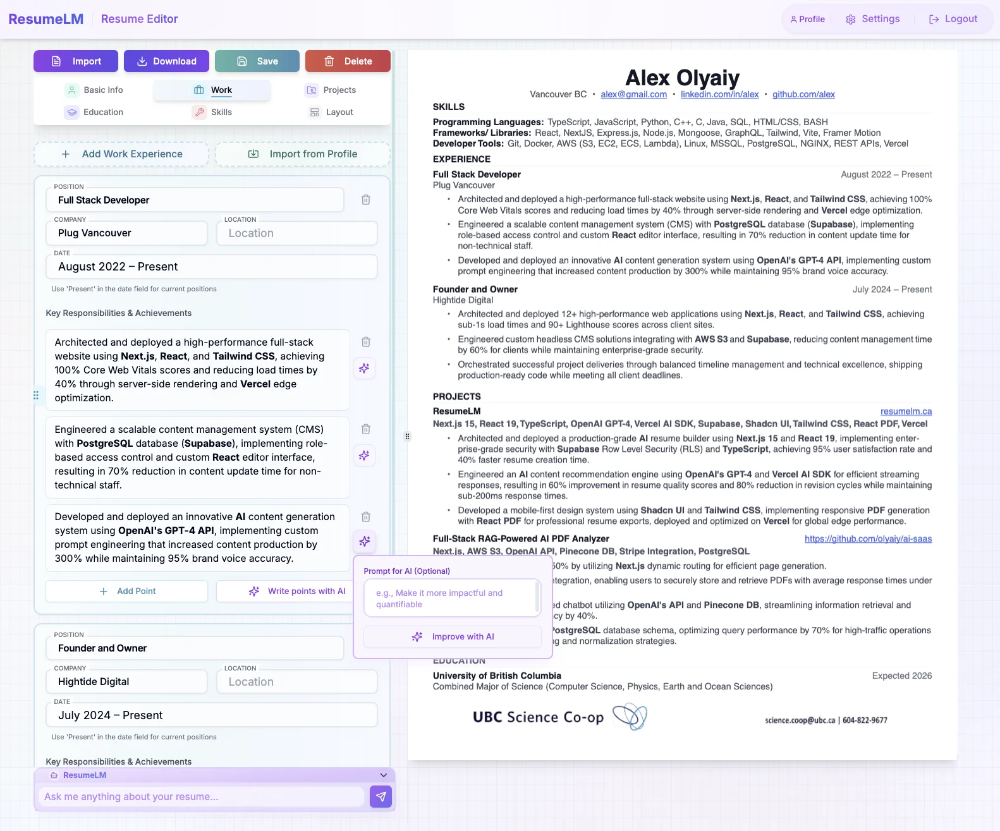
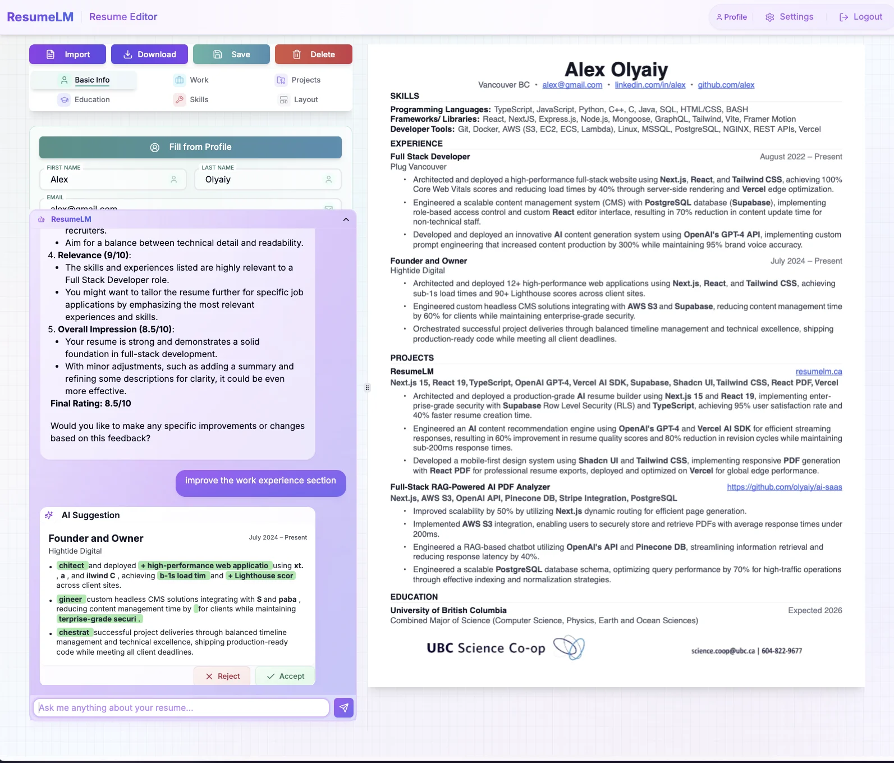
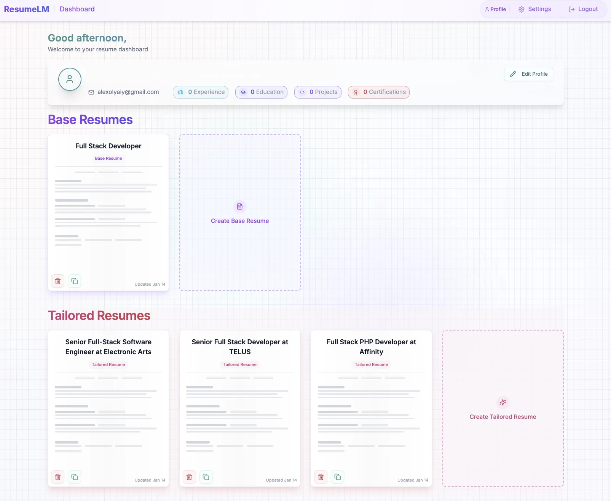

# ResumeLM - AI-Powered Resume Builder

Try it out at [resumelm.com](https://resumelm.com)!

> 🚧 **Under Active Development** 

An intelligent, open-source resume builder powered by AI that helps create and tailor resumes for specific job applications. Built with Next.js 15, React 19, TypeScript, and Shadcn UI.



## 🔱 Fork Information & Development Context

**This repository is a fork of the original ResumeLM project by [olyaiy](https://github.com/olyaiy), available at [https://github.com/olyaiy/resume-lm](https://github.com/olyaiy/resume-lm). All credit for the foundational work and initial vision goes to the original creator.**

This fork has adapted its development methodology. Key changes for developers looking to contribute or understand this version include:

*   **Context Management:** This project now utilizes **Cline**, an AI software engineering assistant, in conjunction with a structured **Memory Bank** (located in the `/memory-bank` directory) to maintain project context, track progress, and guide development decisions.
*   **Removal of Previous Context Systems:** Any previous context management systems specific to other development environments (such as `.cursorrules` or similar hidden directory configurations) have been removed in favor of the Memory Bank approach. Future development and contributions should leverage and update the Memory Bank.

## ✨ Live Demo

Check out the live demo at [resumelm.com](https://resumelm.com)

## 🌟 Key Features

### Resume Management
- 📝 Two-tier resume system:
  - **Base Resumes**: Foundation templates for your professional profile
  - **Tailored Resumes**: AI-optimized versions for specific job applications
- 💼 Comprehensive section management for:
  - Work Experience
  - Education
  - Projects
  - Skills
- 📊 Resume scoring system to measure effectiveness
- 🗂️ Resume sorting and organization
- 📱 Mobile-first approach with responsive layouts
- 🎨 Modern, responsive design with soft gradient minimalist theme



### AI Integration
- 🤖 AI-powered content suggestions for all resume sections
- 💡 Smart content optimization and improvement recommendations
- 🎯 Intelligent job description analysis
- 💬 Interactive AI assistant for resume writing guidance
- ✨ Real-time content enhancement suggestions
- 🔄 Multiple AI model support (OpenAI, Claude, Gemini, DeepSeek, Groq)



### Cover Letter Generation
- 📝 Integrated cover letter editor
- 🤖 AI-assisted cover letter creation
- 🔄 Synchronized with resume data
- 📁 Export capabilities

### Profile Management
- 👤 User profile creation and management
- 🎓 Education history tracking
- 💼 Work experience management
- 🛠️ Skills inventory
- 🚀 Projects showcase

### Technical Features
- 🔒 Row Level Security (RLS) for data protection
- 🚀 Server-side rendering with Next.js 15 App Router
- 📄 PDF generation and preview
- 🎨 Custom design system with consistent UI/UX
- 🔄 Real-time updates and preview

## 🎨 Design System

### Core Principles
- **Layered Depth**: Multiple translucent layers create visual hierarchy
- **Organic Motion**: Subtle animations suggest liveliness without distraction
- **Purposeful White Space**: Generous spacing improves content digestion
- **Consistent Interaction**: Predictable hover and active states

## 🛠️ Tech Stack

### Frontend
- Next.js 15 (App Router)
- React 19
- TypeScript
- Shadcn UI Components
- Tailwind CSS
- React PDF

### AI & Data Processing
- OpenAI Integration
- Server Components for AI Processing
- Structured JSON Data Format

### Database
- PostgreSQL with Row Level Security
- Prisma ORM
- Supabase Auth

## 🧪 Testing

This project uses [Jest](https://jestjs.io/) for running tests. The tests are located in the `/tests` directory.

Key tests include:
- `tests/ai.test.ts`: Focuses on testing the AI-driven resume tailoring functionality, ensuring the output adheres to the defined Zod schemas and content expectations.
- Sample data files like `tests/sample-base-resume.ts` and `tests/sample-job-description.ts` are used to provide consistent input for these tests.

To run the tests, you can use:
```bash
pnpm test
# or if you use npm
# npm run test 
```
Ensure your `.env.test` file is configured with necessary API keys if tests involve live API calls.

## 🚀 Getting Started

1. Clone the repository:
```bash
git clone https://github.com/olyaiy/resume-lm.git
```

2. Install dependencies:
```bash
npm install
# or
pnpm install
```

3. Set up your environment variables:
```bash
cp .env.example .env.local
```

Required environment variables: Copy `.env.example` to `.env.local` and fill in the values.
   - **Supabase Keys**: Essential for database and authentication.
   - **AI API Keys**: Required for AI features. You can add keys for services like OpenAI, Anthropic, etc. The application will allow selection based on configured keys.
   - **Redis Configuration (Optional)**: Used for rate limiting. The application will function without these, but rate limiting will be disabled.
   - See `.env.example` for all variables.

4. Set up the database:

This application uses Supabase for authentication and database features. You need to create a Supabase project and set up the required tables.

**Option 1: Using the SQL Editor in Supabase Dashboard**
   - Copy the contents of `schema.sql` from this repository
   - Open your Supabase project dashboard
   - Go to SQL Editor
   - Paste and run the SQL script

**Option 2: Using the Supabase CLI (for migrations)**
   - If you are managing schema changes through Supabase migrations (typically in the `supabase/migrations` directory), you would use commands like `supabase db push`.
   - However, for applying the consolidated `schema.sql` file directly if you're setting up fresh and not using the individual migration files, Option 1 (SQL Editor) is generally more straightforward.

5. Start the development server:
```bash
npm run dev
# or
pnpm dev
```

Open [http://localhost:3000](http://localhost:3000) to view the application.

### Database Schema

This application requires several tables in your Supabase database:

- **profiles**: Stores user profile information including work experience, education, and skills
- **resumes**: Stores user-created resumes and their content
- **jobs**: Tracks job descriptions for resume tailoring
- **subscriptions**: Originally for managing user subscription status. In this local version, its role is significantly reduced or vestigial as subscription features have been removed. Core user data is in `profiles`.

The complete schema with all required fields is provided in the `schema.sql` file.

## 🏗️ Project Status

### Production Ready Features
- ✅ Complete resume management system
- ✅ AI-powered content generation and optimization
- ✅ PDF export functionality
- ✅ Responsive design system
- ✅ User authentication and authorization
- ✅ Profile management
- ✅ Real-time preview and editing

### Upcoming Features
- 🔄 Enhanced AI tailoring algorithms
- 🔄 Additional resume templates
- 🔄 Advanced PDF customization
- 🔄 Job application tracking
- 🔄 Analytics dashboard

## 📝 Contributing

We welcome contributions! Please see our [Contributing Guide](CONTRIBUTING.md) for details.

## 📄 License

[GNU Affero General Public License v3 (AGPL-3.0)](LICENSE)

This project is licensed under the GNU AGPL v3 license. This means:
- ✅ You can view, use, and modify the code
- ✅ You can distribute the code
- ✅ You must keep the source code open source
- ✅ Any modifications must also be under AGPL-3.0
- ❌ You cannot use this code in closed-source commercial applications
- ❌ You cannot use this code to provide a similar service without making your code open source

For more details, see the [full license text](LICENSE).

---

Built with ❤️ using [Next.js](https://nextjs.org/)
