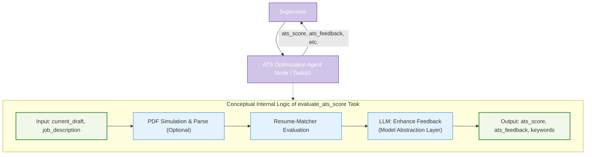

# Agent Node/Task Architecture: ATS Optimization

This document details the architecture and role of the ATS (Applicant Tracking System) Optimization component (implemented as an Agent Node or `@task` function) within the LangGraph Cognitive Agent Backend for Resume-LM.



## 1. Strategic Role

The ATS Optimization component plays a crucial quality assurance role. Its primary strategic purpose is to objectively evaluate the current `current_draft` (produced by the `resume_drafting_agent`) against the `original_job_description` for compatibility with Applicant Tracking Systems.

A key aspect is **ATS Realism**: ideally, it simulates how an actual ATS would process the resume. This might involve rendering the JSON draft into a PDF, parsing this PDF, and then analyzing the extracted text using `resume-matcher`. Alternatively, direct analysis of the JSON content can be performed, with PDF simulation as a more thorough validation.

This component generates a quantitative ATS score and qualitative, LLM-enhanced feedback. This output is critical for the Supervisor Agent's quality gate.

## 2. Core Responsibilities

*   **ATS Realism Simulation (Optional but Recommended):** Render the `current_draft` (JSON) to a document format (e.g., PDF) and parse it for realistic text representation.
*   **Resume-Matcher Integration:** Utilize the `resume-matcher` library on the resume text (either from PDF simulation or directly from JSON) and job description.
*   **Keyword Analysis & Score Generation:** Perform keyword analysis and calculate an ATS compatibility score.
*   **LLM-Enhanced Feedback Generation:** Use an LLM (via Model Abstraction Layer) to synthesize raw `resume-matcher` outputs and `target_ats_objective` into actionable feedback.
*   **State Update Preparation:** Prepare ATS metrics and feedback for updating `ResumeState`.

## 3. Inputs to Agent Node/Task(s)

Typically, as arguments to a `@task` decorated function:
*   `resume_content: dict` (corresponds to `current_draft` from `ResumeState`): The current JSON draft.
*   `job_description: str` (corresponds to `original_job_description` from `ResumeState`).
*   `document_settings: dict` (Potentially, if PDF simulation is performed here).
*   `target_ats_objective: float` (from `ResumeState`).

## 4. Outputs from Agent Node/Task(s)

A dictionary containing updates for `ResumeState`:
*   `ats_score: float`
*   `ats_feedback: str` (LLM-enhanced, actionable suggestions).
*   `keywords_matched: list`
*   `keywords_missing: list`
*   (Potentially) `keyword_analysis_raw: dict` (raw output from resume-matcher).

The Supervisor Agent uses these outputs to update `ResumeState`.

## 5. Key Internal Steps / Logic

1.  **Prepare Resume Text:**
    *   **Ideal:** Render `resume_content` (JSON) to PDF using `document_settings`, then parse the PDF to get `parsed_resume_text`.
    *   **Fallback/Alternative:** Convert `resume_content` (JSON) directly to a flat text string if PDF simulation is too complex or slow for every iteration.
2.  **Prepare Job Text:** Extract relevant text from `job_description` (if it's structured) or use it directly.
3.  **Run Resume-Matcher:**
    *   Initialize `ResumeParser` with `parsed_resume_text` (or flat resume text).
    *   Initialize `JobParser` with job text.
    *   Create `Matcher` and calculate `score`, `keyword_analysis_result`, `missing_keywords_list`.
4.  **Generate LLM-Enhanced Feedback:**
    *   Use an LLM (via Model Abstraction Layer) to process the raw metrics from `resume-matcher` and the `target_ats_objective`.
    *   The LLM generates concise, actionable feedback.
5.  **Return Results:** Package `ats_score`, `ats_feedback`, `keywords_matched`, and `keywords_missing` for output.

## 6. Resume-Matcher Integration Details

*   As described previously, using `ResumeParser`, `JobParser`, and `Matcher`. The key input is the method of obtaining `parsed_resume_text`.

## 7. Implementation Example (@task based)

This example reflects the user's proposed functional API approach.

```python
from langgraph.func import task
# from .model_abstraction_layer import model_registry, ModelCategory # Conceptual
# from resume_matcher import ResumeParser, JobParser, Matcher # Conceptual
# from .parsing_utils import parse_ats_feedback, convert_resume_json_to_text_for_matcher # Conceptual

# Placeholder for ResumeState and other utilities
# class ResumeState(TypedDict): ...
# class model_registry:
#   @staticmethod
#   def get_model_with_fallbacks(model_key, temperature): return None # Placeholder
# class ModelCategory: ANALYTICAL = "analytical"
# def parse_ats_feedback(content): return {"feedback_text": "parsed feedback", "keywords_matched": [], "keywords_missing": []} # Placeholder
# def convert_resume_json_to_text_for_matcher(resume_json): return "text version of resume" # Placeholder
# class resume_matcher: # Placeholder for the library
#   @staticmethod
#   def evaluate(resume_content_dict, job_description_str): return 0.75 # Placeholder score

# Assume SystemMessage, HumanMessage are imported from langchain_core.messages

@task(safe_task_wrapper(fallback_return=conservative_ats_fallback, max_retries=2)) # Using user's error wrapper
def evaluate_ats_score_task(inputs: dict) -> dict: # inputs: {"resume_content": dict, "job_description": str}
    """Evaluate the ATS compatibility score of the resume."""
    resume_content = inputs.get("resume_content")
    job_description = inputs.get("job_description")
    # target_ats_objective = inputs.get("target_ats_objective", 0.85) # Could be passed if LLM needs it

    # Conceptual: PDF Simulation and Parsing or Direct JSON to Text
    # parsed_resume_text = convert_resume_json_to_text_for_matcher(resume_content) # Simplified
    
    # Placeholder for actual resume-matcher call
    # For simplicity, using the user's direct call to a conceptual resume_matcher.evaluate
    try:
        # score = resume_matcher.evaluate(resume_content, job_description) # This was in user's example
        # Simulate a more detailed process:
        # resume_parser = ResumeParser(parsed_resume_text)
        # job_parser = JobParser(job_description) # Assuming job_description is already plain text
        # matcher = Matcher(resume_parser, job_parser)
        # score = matcher.calculate_match_score()
        # raw_keyword_analysis = matcher.keyword_analysis()
        # raw_missing_keywords = matcher.get_missing_keywords()
        
        # Placeholder values if resume_matcher not fully integrated in this snippet
        score = 0.78 
        raw_keyword_analysis = {"matched": ["Python", "API"], "missing_in_resume": ["Cloud"]}
        raw_missing_keywords = ["Cloud", "Deployment"]

    except Exception as e:
        # Fallback handled by safe_task_wrapper, but can log here too
        print(f"Error during resume_matcher processing: {e}")
        raise # Re-raise for the wrapper

    # LLM-enhanced feedback
    # model = model_registry.get_model_with_fallbacks("groq/llama-3.3-70b-versatile", temperature=0.2) # Actual call
    # response = model.invoke([
    #     SystemMessage(content="Analyze this resume's ATS compatibility."),
    #     HumanMessage(content=f"""
    #     Resume (content summary): {str(resume_content)[:500]}...
    #     Job Description: {job_description[:500]}...
    #     ATS Score: {score}
    #     Raw Keyword Analysis: {raw_keyword_analysis}
    #     Raw Missing Keywords: {raw_missing_keywords}
        
    #     Provide detailed, actionable feedback to improve the score, focusing on keywords and structure.
    #     Return as a JSON object with keys: "feedback_text", "keywords_matched", "keywords_missing".
    #     """)
    # ])
    # feedback_data = parse_ats_feedback(response.content) # Placeholder

    # Placeholder for LLM feedback generation
    feedback_data = {
        "ats_feedback": f"Score is {score*100:.0f}%. To improve, focus on: {', '.join(raw_missing_keywords)}. Good job on matching: {', '.join(raw_keyword_analysis.get('matched',[]))}.",
        "keywords_matched": raw_keyword_analysis.get("matched", []),
        "keywords_missing": raw_missing_keywords
    }
    
    return {
        "ats_score": score,
        "ats_feedback": feedback_data.get("ats_feedback"),
        "keywords_matched": feedback_data.get("keywords_matched"),
        "keywords_missing": feedback_data.get("keywords_missing")
        # "keyword_analysis_raw": raw_keyword_analysis # Optionally return raw data
    }

# Fallback function (as provided by user, conceptual)
def conservative_ats_fallback(inputs: dict):
    # resume_content = inputs.get("resume_content")
    # job_description = inputs.get("job_description")
    # def extract_basic_keywords(rc, jd): return [] # Placeholder
    return {
        "ats_score": 0.65,
        "ats_feedback": "Unable to perform detailed ATS analysis. Consider reviewing keywords manually.",
        "keywords_matched": [], # extract_basic_keywords(resume_content, job_description),
        "keywords_missing": ["Unknown - ATS analysis failed"]
    }
```

**Note on LLM Usage:** The LLM interaction for generating enhanced feedback is managed by the central Model Abstraction Layer (`model_abstraction_layer.md`).

This component provides the objective metrics necessary for the Supervisor Agent to make informed decisions about quality and potential revisions.
