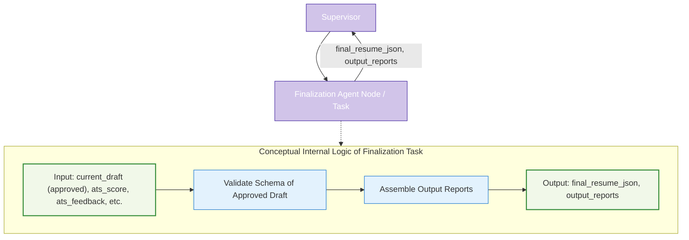

# Agent Node/Task Architecture: Finalization

This document details the architecture and role of the Finalization component (implemented as an Agent Node or `@task` function) within the LangGraph Cognitive Agent Backend for Resume-LM. This is the last component in the workflow after human approval (if enabled) and before the Supervisor Agent signals the end of the graph. **This component does not modify resume content or formatting.**



## 1. Strategic Role

The Finalization component serves as the ultimate checkpoint before the tailored resume is returned to the user via the API. Its strategic role is to:
1.  Perform a **strict final validation** of the human-approved `current_draft` (JSON resume) against Resume-LM's canonical data schema (e.g., Zod schema for database and PDF renderer compatibility).
2.  **Assemble all generated reports** (ATS analysis, change summary) into a structured format for the API response.
3.  Ensure that **no further modifications** are made to the resume content or its implicit formatting after it has been approved by a human (or passed the automated quality gate if human review is skipped).

This component guarantees data integrity and completeness of the final output package. It's typically implemented as a single `@task` function.

## 2. Core Responsibilities

*   **Schema Validation:** Rigorously validate the structure and data types of the incoming `current_draft` (which is the human-approved version) against the definitive Resume-LM schema.
*   **Report Assembly:** Consolidate all relevant reports and metadata from `ResumeState`, such as:
    *   `ats_score`.
    *   `ats_feedback`.
    *   `keywords_matched`, `keywords_missing`.
    *   (If tracked) A summary of changes made.
*   **Output Structuring:** Package the validated resume JSON and the assembled reports into specific fields in the dictionary returned by the task (e.g., `final_resume_json`, `output_reports`).
*   **Integrity Assurance:** Explicitly ensure that the resume content (`current_draft`) passed into this task is the same content set as `final_resume_json`, preserving the integrity of the human-approved version.

**Non-Responsibilities:**
*   This component **does not** perform any content modification, rephrasing, or summarization.
*   It **does not** make any formatting adjustments. All such operations must have been completed by the `resume_drafting_agent` prior to human review.

## 3. Inputs to Agent Node/Task

The Finalization component (e.g., a `@task` function) receives relevant parts of the `ResumeState` as inputs, such as:

*   `current_draft: dict`: The JSON draft of the resume, approved by human review or the quality gate.
*   `ats_score: float`, `ats_feedback: str`, `keywords_matched: list`, `keywords_missing: list`: Data for the ATS report.
*   (Potentially) `change_summary_data: dict`: Data for a change summary report.

## 4. Outputs from Agent Node/Task

This component returns a dictionary containing updates for `ResumeState`:
*   `final_resume_json: dict`: The validated (and unmodified from input `current_draft`) JSON resume object.
*   `output_reports: dict`: A structured object containing the ATS compatibility report and any change summary.
*   (Optionally) `finalization_status: str` (e.g., "success", "validation_error").

The Supervisor Agent uses these outputs to update `ResumeState` and will typically set `current_phase` to `after_finalization` or similar.

## 5. Key Internal Steps / Logic

1.  **Receive Approved Draft & Report Data:** Access the `current_draft` and other report-related data from the input arguments (derived from `ResumeState`).
2.  **Validate Final Structure:** Perform strict validation of `current_draft` against the canonical Resume-LM Zod schema.
    *   **Error Handling:** If validation fails, log this critical issue. The `final_resume_json` might be set to the problematic draft with an error flag/status, or the task could raise an exception to be handled by a `safe_task_wrapper`. No content fixing occurs here.
3.  **Assemble Output Reports:** Package `ats_score`, `ats_feedback`, etc., into a user-friendly ATS report structure. Format `change_summary_data` if available.
4.  **Return Results:** Create a dictionary with `final_resume_json` (which is the unmodified `current_draft`) and the structured `output_reports`.

## 6. Implementation Example (@task based)

```python
from langgraph.func import task
from typing import Dict, Any, Optional, List # Assuming ResumeState is defined

# Placeholder for ResumeState and schema validation utility
# class ResumeState(TypedDict): ...
# def validate_resume_schema(resume_json: Dict) -> bool:
#     # Placeholder for actual Zod schema validation logic
#     # This would typically involve a library or a call to a validation service
#     if "basics" in resume_json and "work" in resume_json:
#         return True
#     return False

@task
def finalization_task(inputs: Dict[str, Any]) -> Dict[str, Any]:
    """
    Validates the final resume draft against the schema and assembles output reports.
    Does not modify resume content.
    """
    current_draft = inputs.get("current_draft")
    ats_score = inputs.get("ats_score")
    ats_feedback = inputs.get("ats_feedback")
    keywords_matched = inputs.get("keywords_matched", [])
    keywords_missing = inputs.get("keywords_missing", [])
    # change_summary_data = inputs.get("change_summary_data") # If available

    final_resume_json = current_draft # Preserve integrity
    validation_passed = True # validate_resume_schema(current_draft) # Actual validation call

    if not validation_passed:
        # Log critical error, potentially add error info to reports
        # For now, we'll assume it passes or error is handled by wrapper
        print(f"CRITICAL ERROR: Final resume schema validation failed for draft: {current_draft.get('id', 'unknown')}")
        # Depending on error strategy, could raise an exception or include error in output

    # Assemble reports
    ats_report = {
        "score": ats_score,
        "feedback": ats_feedback,
        "keywords_matched": keywords_matched,
        "keywords_missing": keywords_missing
    }
    output_reports = {"ats_report": ats_report}
    # if change_summary_data:
    #     output_reports["change_summary"] = format_change_summary(change_summary_data)


    return {
        "final_resume_json": final_resume_json,
        "output_reports": output_reports,
        "finalization_status": "success" if validation_passed else "validation_error"
    }

# This task would be called by the supervisor:
# final_updates = finalization_task.invoke({
#     "current_draft": state["current_draft"],
#     "ats_score": state["ats_score"],
#     # ... other necessary report data from state ...
# })
# state.update(final_updates)
```

This component ensures that what the user approved is what they receive, and that it's technically sound for use in the Resume-LM ecosystem.
