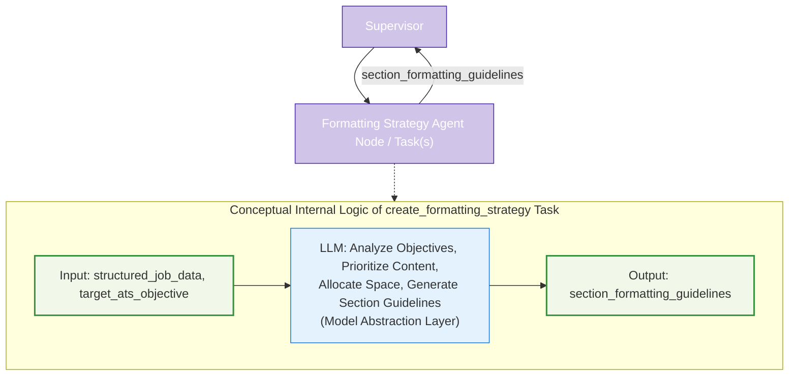

# Agent Node/Task Architecture: Formatting Strategy

This document details the architecture and role of the Formatting Strategy component (implemented as an Agent Node or `@task` function) within the LangGraph Cognitive Agent Backend for Resume-LM. This component is responsible for defining specific formatting constraints and content strategies before the main drafting process begins.



## 1. Strategic Role

The Formatting Strategy component plays a critical preparatory role in the resume tailoring workflow. It translates high-level objectives (like `target_ats_objective` and `target_page_count`) and prioritized content into concrete, actionable formatting guidelines for each section of the resume. Its primary strategic purpose is to ensure that the downstream `resume_drafting_agent` has a clear blueprint for constructing a layout-aware resume that can realistically meet all specified constraints.

This component effectively decouples the *strategic planning of format and content density* from the *actual drafting and detailed formatting execution*. It's typically implemented as a `@task` function.

## 2. Core Responsibilities

*   **Objective Analysis:** Interpret `target_ats_objective`, `key_content_to_emphasize` (from objective setting), and `target_page_count` to understand overall goals.
*   **Content Prioritization (Conceptual):** Implicitly, when generating guidelines, prioritize content based on its relevance to job and ATS objectives.
*   **Dynamic Space Allocation & Guideline Generation (LLM-assisted):**
    *   Estimate available "space" (character counts, bullet counts) per section based on `target_page_count` and content priorities.
    *   Define specific `section_formatting_guidelines` for each section, including max characters, target bullet points, conciseness levels, and keywords to emphasize. This is done via an LLM call managed by the Model Abstraction Layer.
*   **State Update Preparation:** Prepare the generated `section_formatting_guidelines` to be returned for updating `ResumeState`.

## 3. Inputs to Agent Node/Task(s)

Typically, as arguments to a `@task` decorated function:
*   `structured_job_data: dict`: Processed job information.
*   `target_ats_objective: float`: The desired ATS score.
*   `key_content_to_emphasize: list` (Potentially): A structured list of content items critical for the objective (from the objective setting phase).
*   `base_resume_content: str` (Potentially): To understand content volume.
*   `target_page_count: int`: User-defined page limit.
*   `user_preferences` or `base_styling_preferences` (Potentially): General style or density preferences.

The user's example `create_formatting_strategy` task uses `structured_job_data` and `target_ats_objective`.

## 4. Outputs from Agent Node/Task(s)

A dictionary containing updates for `ResumeState`:
*   `section_formatting_guidelines: dict`: A structured object where keys are section names and values are detailed formatting constraints.
    *   Example:
        ```json
        {
          "summary": { "max_chars": 800, "conciseness": "high", "keywords": ["keyword1"] },
          "work_experience_item_abc": { "max_bullets": 4, "bullet_max_chars": 200, "focus_keywords": ["project management"] }
        }
        ```
The Supervisor Agent uses this output to update `ResumeState`.

## 5. Key Internal Steps / Logic

The logic is primarily encapsulated within an LLM call, managed by the Model Abstraction Layer:

1.  **Prepare Prompt:** Construct a prompt for the LLM that includes `structured_job_data`, `target_ats_objective`, and `target_page_count`. The prompt instructs the LLM to analyze these inputs, consider content prioritization implicitly, estimate space allocation, and generate detailed section-by-section formatting guidelines (character limits, bullet counts, keywords, layout constraints).
2.  **Invoke LLM:** Call the LLM using the Model Abstraction Layer, specifying requirements for reasoning, formatting capabilities, and JSON output.
3.  **Parse Response:** Parse the LLM's JSON response to extract the `section_formatting_guidelines`.
4.  **Return Results:** Package the guidelines into a dictionary.

**Note on LLM Usage:** All LLM interactions are managed by the central Model Abstraction Layer (`model_abstraction_layer.md`).

## 6. Implementation Example (@task based)

This example reflects the user's proposed functional API approach.

```python
from langgraph.func import task # Assuming this and ResumeState are defined
# from .model_abstraction_layer import model_registry, ModelCategory # Conceptual
# from .parsing_utils import parse_formatting_guidelines # Conceptual

# Placeholder for ResumeState and other utilities
# class ResumeState(TypedDict): ...
# class model_registry:
#   @staticmethod
#   def get_model(config): return None # Placeholder
# class ModelCategory: REASONING = "reasoning"; FORMATTING = "formatting"
# def parse_formatting_guidelines(content): return {"summary": {"max_chars": 800}} # Placeholder

# Assume SystemMessage, HumanMessage are imported from langchain_core.messages

@task
def create_formatting_strategy_task(inputs: dict) -> dict: # inputs: {"structured_job_data": dict, "target_ats_objective": float}
    """Create formatting guidelines for the resume."""
    structured_job_data = inputs.get("structured_job_data")
    target_ats_objective = inputs.get("target_ats_objective")
    # target_page_count = inputs.get("target_page_count", 1) # Example: could be passed in

    # model = model_registry.get_model({ # Actual call
    #     "required_capabilities": [ModelCategory.REASONING, ModelCategory.FORMATTING],
    #     "response_format": "json"
    # })
    
    # response = model.invoke([
    #     SystemMessage(content="Create detailed, section-specific formatting guidelines for a resume."),
    #     HumanMessage(content=f"""
    #     Job Requirements: {structured_job_data}
    #     Target ATS Score: {target_ats_objective}
    #     Target Page Count: {target_page_count} # Assuming target_page_count is available
        
    #     Create section-by-section formatting guidelines including:
    #     1. Character limits per section/item
    #     2. Number of bullet points per experience/project
    #     3. Keywords to emphasize within sections
    #     4. Overall layout constraints to meet page limit.
    #     Return as a JSON object.
    #     """)
    # ])
    # formatting_guidelines = parse_formatting_guidelines(response.content) # Placeholder

    # Placeholder for LLM call and parsing
    formatting_guidelines = {
        "summary": {"max_chars": 750, "conciseness": "high", "keywords": ["lead", "develop"]},
        "experience_default": {"max_bullets": 4, "bullet_max_chars": 180},
        "skills": {"max_skills_to_list": 20, "format": "bullet_list"}
    }
    
    return {"section_formatting_guidelines": formatting_guidelines}

# This task would be called by the supervisor:
# fmt_updates = create_formatting_strategy_task.invoke({
#     "structured_job_data": state["structured_job_data"],
#     "target_ats_objective": state["target_ats_objective"]
# })
# state.update(fmt_updates)
```

This component ensures that the `resume_drafting_agent` receives clear, actionable instructions on how to structure and constrain its generated content to meet overall objectives and page limits.
