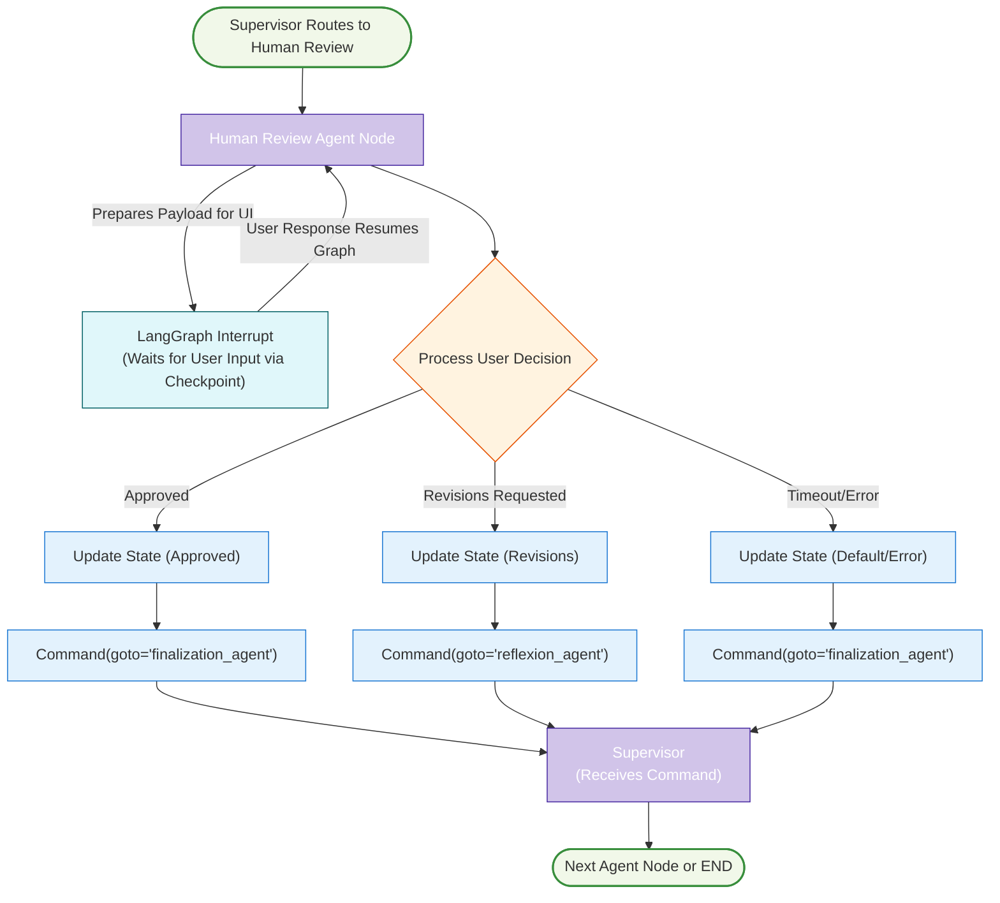

# Agent Node Architecture: Human Review (Native Interrupt)

This document details the architecture and role of the Human Review Agent Node within the LangGraph Cognitive Agent Backend for Resume-LM. This node serves as an optional, strategic interrupt point in the workflow, leveraging LangGraph's native interrupt capabilities.



## 1. Strategic Role

The Human Review Agent Node provides an optional but potentially critical quality assurance step, allowing for human oversight before a tailored resume is finalized. Its strategic role is to bridge the gap between automated AI generation/ATS optimization and the user's final approval or specific revision requests. This node uses LangGraph's native `interrupt` feature to pause execution and await external input, empowering the user to validate the `layout_aware_draft_resume_json`.

This node is invoked by the Supervisor Agent after the ATS Optimization phase if the ATS score meets the quality threshold and human review is enabled. Based on the user's feedback, this node returns a `Command` to the Supervisor, which then routes to either the `reflexion_agent` (for revisions) or the `finalization_agent` (for approval/timeout).

## 2. Core Responsibilities

*   **Data Presentation:** Prepare the current `layout_aware_draft_resume_json` and relevant ATS metrics from `ResumeState` for presentation to the user (typically rendered as a PDF by the frontend).
*   **Workflow Interruption:** Utilize `langgraph.types.interrupt` to pause graph execution, making the prepared data available at a checkpoint for the Resume-LM application to fetch and display.
*   **User Feedback Collection:** Process the user's decision (e.g., "approved," "revise") and any textual feedback provided when the graph execution is resumed.
*   **State Update Preparation:** Prepare updates for `ResumeState` with the user's decision (`human_decision`) and feedback (`human_feedback`).
*   **Timeout Handling (Conceptual):** Logic for timeouts (e.g., defaulting to approval) is managed within the node's response processing.
*   **Return Command to Supervisor:** Return a `Command` object to the Supervisor indicating the next agent node to route to (e.g., `reflexion_agent` or `finalization_agent`) and including the state updates.

## 3. Inputs to Agent Node (from ResumeState)

The Human Review Agent Node accesses the following from the `ResumeState`:

*   `current_draft` (previously `layout_aware_draft_resume_json`): The JSON draft of the resume.
*   `document_settings`: Document settings (font, margins) used for rendering the draft.
*   `ats_score`: The ATS compatibility score.
*   `target_ats_objective`: The target ATS score.
*   `keywords_matched`, `keywords_missing` (if available from ATS optimization).
*   (Potentially) `user_preferences` indicating if human review is mandatory.

## 4. Outputs from Agent Node (updates to ResumeState via Command)

The agent node returns a `Command` object that includes updates for `ResumeState`:
*   `human_decision: Literal["approved", "revise", "timeout", "error"]`: The outcome of the review.
*   `human_feedback: Optional[str]`: Textual feedback if revisions are requested.
*   `error: Optional[str]`: If an error occurred during feedback processing.
The `Command` also specifies `goto` for the Supervisor (e.g., `finalization_agent` or `reflexion_agent`).

## 5. Key Internal Steps within the Agent Node

1.  **Prepare Interrupt Payload:**
    *   Accesses `current_draft`, `ats_score`, `target_ats_objective`, etc., from the input `ResumeState`.
    *   Constructs a `review_context` dictionary containing all necessary information for the user to review the draft (e.g., the draft itself, ATS score, target score, a question to the user).
2.  **Trigger LangGraph Interrupt:**
    *   Calls `langgraph.types.interrupt(review_context)`. This pauses graph execution.
    *   The `review_context` is stored at the checkpoint, accessible by the frontend application.
3.  **Process User Response (upon graph resumption):**
    *   When the graph is resumed (e.g., by the frontend sending back user's input), the `human_response` is received by the node.
    *   The node parses this response to determine if it was an approval, a revision request (with feedback), or a timeout/error.
4.  **Prepare `Command` with State Updates and Routing:**
    *   Based on the processed response, sets `human_decision` and `human_feedback` in a dictionary for state updates.
    *   Determines the next agent node (`finalization_agent` for approval/timeout/error, `reflexion_agent` for revisions).
    *   Returns `Command(goto="next_agent_node_name", update=state_updates_dict)`.

## 6. Implementation Example

The following Python snippet is based on the user's provided `human_review_node` and `human_review_with_timeout`, adapted to fit the agent node context and `ResumeState` structure.

```python
from typing import TypedDict, Dict, List, Any, Literal, Optional
from langgraph.types import Command, interrupt

# Assuming ResumeState is defined as in supervisor_graph_architecture.md
# class ResumeState(TypedDict): ...

class HumanFeedback(TypedDict): # For structured feedback from UI
    approved: bool
    feedback: Optional[str]

def human_review_agent_node(state: ResumeState) -> Command[Literal["reflexion_agent", "finalization_agent"]]:
    """
    Pauses graph execution for human review using LangGraph's native interrupt.
    Processes human feedback and returns a Command to the supervisor.
    """
    # Prepare context for the human reviewer
    review_context = {
        "resume_draft": state.get("current_draft"),
        "ats_score": state.get("ats_score"),
        "target_score": state.get("target_ats_objective"),
        "keywords_matched": state.get("keywords_matched", []), # Assuming these are in state
        "keywords_missing": state.get("keywords_missing", []), # Assuming these are in state
        "question": "Please review this resume draft. Is it acceptable or does it need revisions?"
        # Potentially add timeout_seconds if handled by interrupt mechanism directly
    }

    # Interrupt the flow and wait for human input
    # The 'human_response' will be populated when the graph is resumed with input.
    # This input is expected to be passed into the state when resuming.
    human_response_from_resume: Optional[HumanFeedback] = interrupt(checkpoint=review_context)
    
    updates: Dict[str, Any] = {}
    next_node: Literal["reflexion_agent", "finalization_agent"]

    try:
        if human_response_from_resume is None: # Indicates a timeout or issue if not handled by a wrapper
            # Defaulting to timeout behavior, assuming supervisor will route to finalization
            updates["human_decision"] = "timeout"
            updates["human_feedback"] = "Review timed out, proceeding with current draft."
            updates["warning"] = "Human review timed out"
            next_node = "finalization_agent"
        
        elif isinstance(human_response_from_resume, dict):
            approved = human_response_from_resume.get("approved", False)
            feedback = human_response_from_resume.get("feedback", "")
            
            updates["human_decision"] = "approved" if approved else "revise"
            updates["human_feedback"] = feedback
            
            if approved:
                next_node = "finalization_agent"
            else:
                next_node = "reflexion_agent"
        else: # Fallback for unexpected response format
            updates["human_decision"] = "error"
            updates["human_feedback"] = f"Unexpected feedback format: {human_response_from_resume}"
            updates["error"] = "Error processing human feedback format."
            next_node = "finalization_agent" # Default to finalize on error

    except Exception as e:
        updates["human_decision"] = "error"
        updates["human_feedback"] = f"Error processing feedback: {str(e)}"
        updates["error"] = str(e)
        next_node = "finalization_agent" # Default to finalize on error
            
    return Command(goto=next_node, update=updates)

# Conceptual timeout wrapper (if not handled by interrupt config directly)
# This would be part of the graph's invocation logic or a higher-level node.
# For simplicity, the human_review_agent_node above assumes timeout might result in 'None'.
# A more robust timeout handling might involve the supervisor checking timestamps
# or a dedicated timeout mechanism in how interrupts are resumed.
# The user's human_review_with_timeout example provides a threading-based approach.
```

The Human Review Agent Node, using native LangGraph interrupts, provides a robust and well-integrated mechanism for incorporating human judgment into the automated resume tailoring process.
