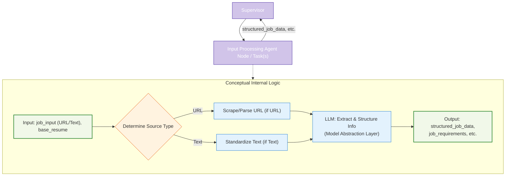

# Agent Node/Task Architecture: Input Processing

This document details the architecture and role of the Input Processing component (implemented as an Agent Node or a collection of `@task` functions) within the LangGraph Cognitive Agent Backend for Resume-LM.



## 1. Strategic Role

The Input Processing component is the initial stage in the resume tailoring workflow, invoked by the Supervisor Agent. Its primary strategic role is to ingest job information—provided either as a URL or raw text—and the user's base resume, then transform the job information into a standardized, structured format. This `structured_job_data`, including extracted key requirements and responsibilities, becomes a crucial input for downstream components like `potential_objective_setting` and `resume_drafting`.

By normalizing diverse input types and pre-processing the job description, this component ensures data consistency and quality for the rest of the tailoring process. It's typically implemented as one or more `@task` functions within the functional API paradigm or as a dedicated agent node.

## 2. Core Responsibilities

*   **Handle Multiple Input Formats:** Accept job information as either a direct URL to a job posting or as pasted raw text of the job description.
*   **Web Scraping (for URLs):** If a URL is provided, attempt to scrape the content of the job posting page.
*   **Text Parsing:** Parse the scraped HTML content or the provided raw text to extract the core job description.
*   **Information Structuring (LLM-assisted):** Convert the processed job description into a consistent, structured format using an LLM via the Model Abstraction Layer. This includes fields like `job_title`, `company_name`, `location`, `full_description_text`.
*   **Fallback Logic:** Implement robust fallback mechanisms if URL scraping fails.
*   **Key Information Extraction (LLM-assisted):** Identify and extract key requirements (e.g., skills, experience years, qualifications) and primary responsibilities from the job description text using an LLM via the Model Abstraction Layer.

## 3. Inputs to Agent Node/Task(s) (from ResumeState or direct arguments)

The Input Processing component receives:

*   `job_description`: A string containing either the URL of the job posting or the raw text of the job description. (Corresponds to `job_input` in previous designs).
*   `base_resume`: The user's base resume content. (Corresponds to `base_resume_content`).
*   `input_type`: (Implicit or explicit) A literal string (`"url"` or `"text"`) indicating the nature of `job_description`.

## 4. Outputs from Agent Node/Task(s) (updates to ResumeState)

This component produces a dictionary of updates for `ResumeState`, including:

*   `structured_job_data`: An object or dictionary containing the normalized and structured information from the job posting.
*   `original_job_description`: The raw job description input.
*   `original_resume`: The raw base resume input.
*   (Potentially) `job_requirements`, `job_responsibilities` if extracted as separate fields.
*   (Potentially) `processing_status` or error flags.

The Supervisor Agent will use these outputs to update the main `ResumeState` and will set the `current_phase` accordingly (e.g., to `after_input_processing`).

## 5. Key Internal Steps / Logic

The logic, whether in a single agent node or distributed across `@task` functions, generally follows these steps:

1.  **Determine Input Source:** Check if `job_description` is a URL or raw text.
2.  **Fetch/Prepare Job Text:**
    *   If URL: Attempt to scrape HTML content. Implement fallback if scraping fails (log error, use minimal info, or signal failure). Parse HTML to get clean text.
    *   If Raw Text: Perform initial cleaning (normalize whitespace).
3.  **Extract Structured Information & Requirements (LLM-assisted):**
    *   Use an LLM (via the Model Abstraction Layer) to parse the cleaned job description text.
    *   Populate fields in `structured_job_data` (e.g., inferring job title, company).
    *   Extract key requirements and responsibilities.
    *   The user's `process_input` example consolidates this into a single LLM call.

**Note on LLM Usage:** All LLM interactions are managed by the central Model Abstraction Layer (`model_abstraction_layer.md`). This includes dynamic model selection (e.g., for basic reasoning, specific context window needs), provider abstraction, and fallback logic.

## 6. Edge Case Handling Specific to Input Processing

This component should handle:

*   **Login-Protected Job Listings / Scraping Failures:** Detect failures, log, and use fallbacks (e.g., rely on any pasted text, extract minimal info, or signal inability to process).
*   **Unstructured Job Descriptions:** Leverage LLMs (via Model Abstraction Layer) to infer structure.
*   **Missing Metadata:** Attempt LLM-based extraction from the body of the description.
*   **Variable Job Ad Formats:** Rely on the robustness of LLM-based parsing.

## 7. Integration with Supervisor Agent

*   The Supervisor Agent invokes the Input Processing component (e.g., `input_processing_agent` node or the first `@task` in this sequence).
*   The component processes the inputs and returns a dictionary of results.
*   The Supervisor Agent uses these results to update `ResumeState` and then routes to the next component (e.g., `format_strategy_agent`) by returning an appropriate `Command`.

## 8. Implementation Example (@task based)

This example reflects the user's proposed functional API approach.

```python
from langgraph.func import task # Assuming this and ResumeState are defined
# from .model_abstraction_layer import model_registry, ModelCategory # Conceptual
# from .parsing_utils import parse_requirements, extract_minimal_job_data # Conceptual

# Placeholder for ResumeState and other utilities
# class ResumeState(TypedDict): ...
# class model_registry:
#   @staticmethod
#   def get_model(config): return None # Placeholder
# class ModelCategory: BASIC = "basic"
# def parse_requirements(content): return {"requirements": content[:100]} # Placeholder
# def extract_minimal_job_data(job_desc): return {"title": "Unknown", "description_text": job_desc[:200]} # Placeholder

# Assume SystemMessage, HumanMessage are imported from langchain_core.messages

@task
def process_input_task(inputs: dict) -> dict: # inputs might be a subset of ResumeState or direct args
    """Process and structure the input job description and resume."""
    job_description = inputs.get("job_description", "")
    base_resume = inputs.get("base_resume", "") # Base resume might be used later or by this task
    
    # Determine input_type (url or text) - logic not shown, assume job_description is text for now
    
    # Simplified: directly use job_description as text
    # In a full implementation: add URL scraping, HTML parsing, text cleaning here
    
    # LLM call via Model Abstraction Layer to extract key requirements
    # model = model_registry.get_model({ # Actual call
    #     "required_capabilities": [ModelCategory.BASIC], # Example requirement
    #     "economy_mode": True,
    # })
    # response = model.invoke([
    #     SystemMessage(content="Extract key requirements and skills from this job description."),
    #     HumanMessage(content=job_description)
    # ])
    # structured_job_data = parse_requirements(response.content)
    
    # Placeholder for LLM call and parsing
    if not job_description:
        structured_job_data = {"error": "No job description provided."}
    else:
        structured_job_data = {
            "title": f"Inferred Job Title for: {job_description[:30]}...",
            "company": "Inferred Company",
            "description_text": job_description,
            "requirements_extracted": [f"Req1 from {job_description[:20]}", f"Req2 from {job_description[:20]}"]
        }

    return {
        "structured_job_data": structured_job_data,
        "original_job_description": job_description, # Pass along original for later use
        "original_resume": base_resume # Pass along original for later use
    }

# This task would be called by the supervisor, e.g.:
# updates = process_input_task.invoke({"job_description": state["job_description"], "base_resume": state["base_resume"]})
# state.update(updates)
# supervisor then returns Command(goto="next_agent_node", update={"current_phase": "new_phase"})
```
This component ensures that subsequent parts of the workflow operate on consistent and well-structured job data.
