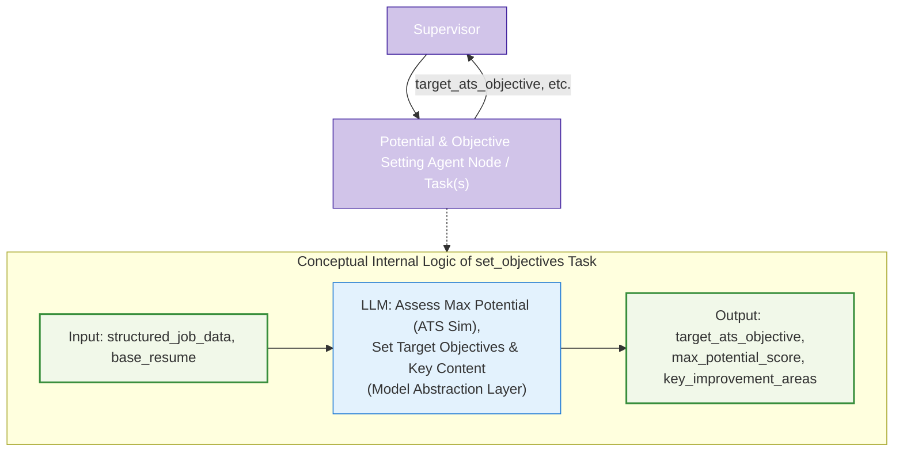

# Agent Node/Task Architecture: Potential & Objective Setting

This document details the architecture and role of the "Potential & Objective Setting" component (implemented as an Agent Node or `@task` functions) within the LangGraph Cognitive Agent Backend for Resume-LM. This component is critical for establishing a clear, measurable, and realistic target for the resume tailoring process.



## 1. Strategic Role

The Potential & Objective Setting component is responsible for analyzing the user's raw resume content (`base_resume`) against a specific job description (`structured_job_data`) to:
1.  Estimate the **maximum possible ATS score** (`max_potential_score`) the user could achieve if their resume content were perfectly optimized for the job. This may involve an "ATS parsing simulation" conceptually, or an LLM-driven analysis.
2.  Establish a **realistic target ATS objective** (`target_ats_objective`) for the current tailoring task.
3.  Identify **key areas for improvement** (`key_improvement_areas`) in the resume to meet this objective.

This component provides the foundational goals and strategic guidance for the downstream `format_strategy_agent` and the `resume_drafting_agent`.

## 2. Core Responsibilities

*   **Max Potential & Target Objective Setting (LLM-assisted):**
    *   Analyze the `base_resume` against `structured_job_data`.
    *   Use an LLM (via the Model Abstraction Layer) to determine:
        *   `max_potential_score`: An estimated maximum ATS score.
        *   `target_ats_objective`: A realistic target score.
        *   `key_improvement_areas`: Specific sections or content aspects needing focus.
    *   The conceptual "ATS parsing simulation" for max potential might be abstracted into the LLM's reasoning process or involve a call to an ATS evaluation tool if needed at this stage.
*   **State Update Preparation:** Prepare these objectives as a dictionary to be returned for updating the main `ResumeState`.

## 3. Inputs to Agent Node/Task(s)

Typically, as arguments to a `@task` decorated function:
*   `structured_job_data: dict`: Output from the input processing component.
*   `base_resume: str`: The user's raw resume content.
*   (Optionally) `user_target_page_count` or other `user_preferences` if they influence objective setting directly.

## 4. Outputs from Agent Node/Task(s)

A dictionary containing updates for `ResumeState`:
*   `max_potential_score: float`: The estimated highest ATS score achievable.
*   `target_ats_objective: float`: The realistic ATS score the system will aim for.
*   `key_improvement_areas: list`: A list of strings or structured objects describing areas to focus on.
*   (Optionally) `objective_setting_feedback: str`: Explanation for how the target objective was set.

The Supervisor Agent uses these outputs to update `ResumeState`.

## 5. Key Internal Steps / Logic

The logic is primarily encapsulated within one or more LLM calls, managed by the Model Abstraction Layer:

1.  **Prepare Prompt:** Construct a prompt for the LLM that includes the `structured_job_data` and `base_resume`. The prompt instructs the LLM to analyze the resume against the job requirements and determine the maximum potential ATS score, a realistic target score, and key areas for improvement.
2.  **Invoke LLM:** Call the LLM using the Model Abstraction Layer, specifying requirements for analytical capabilities and potentially JSON output.
3.  **Parse Response:** Parse the LLM's response to extract `max_potential_score`, `target_ats_objective`, and `key_improvement_areas`.
4.  **Return Results:** Package these values into a dictionary for the calling workflow to update `ResumeState`.

The detailed steps of generating an unconstrained draft and simulating PDF parsing for max potential assessment (as in the previous "subgraph" design) are now abstracted. The LLM, guided by a sophisticated prompt, performs this analysis. If a separate ATS simulation tool is still desired here, the LLM could be prompted to generate a hypothetical optimal resume snippet, which is then scored. However, the user's `set_objectives` example implies a direct LLM assessment.

## 6. Data Schema Compatibility

The `base_resume` input and any internal resume representations should align with or be easily convertible from the project's standard resume schema (e.g., JSON Resume).

## 7. Quality & Realism Safeguards

*   **LLM Prompting:** The prompt for the LLM must be carefully designed to ensure it provides realistic and actionable objectives, grounded in the provided resume and job data.
*   **Model Selection:** The Model Abstraction Layer should select a model with strong analytical and reasoning capabilities for this task.

**Note on LLM Usage:** All LLM interactions are managed by the central Model Abstraction Layer (`model_abstraction_layer.md`).

## 8. Implementation Example (@task based)

This example reflects the user's proposed functional API approach for setting objectives.

```python
from langgraph.func import task # Assuming this and ResumeState are defined
# from .model_abstraction_layer import model_registry, ModelCategory # Conceptual
# from .parsing_utils import parse_objectives # Conceptual

# Placeholder for ResumeState and other utilities
# class ResumeState(TypedDict): ...
# class model_registry:
#   @staticmethod
#   def get_model(config): return None # Placeholder
# class ModelCategory: ANALYTICAL = "analytical"
# def parse_objectives(content): return {"max_potential": 0.9, "target_score": 0.85, "improvement_areas": []} # Placeholder

# Assume SystemMessage, HumanMessage are imported from langchain_core.messages

@task
def set_objectives_task(inputs: dict) -> dict: # inputs: {"structured_job_data": dict, "base_resume": str}
    """Set target objectives for the resume tailoring process."""
    structured_job_data = inputs.get("structured_job_data")
    base_resume = inputs.get("base_resume")

    # model = model_registry.get_model({ # Actual call
    #     "required_capabilities": [ModelCategory.ANALYTICAL],
    #     "response_format": "json"
    # })
    
    # Analyze resume against job requirements
    # response = model.invoke([
    #     SystemMessage(content="Analyze this resume against these job requirements."),
    #     HumanMessage(content=f"""
    #     Job Requirements: {structured_job_data}
    #     Base Resume: {base_resume}
        
    #     Determine:
    #     1. The maximum potential ATS match score (0-1)
    #     2. A realistic target score (slightly below max potential)
    #     3. Key sections/areas that need improvement to reach the target score.
    #     Return as a JSON object.
    #     """)
    # ])
    # objectives = parse_objectives(response.content) # Placeholder

    # Placeholder for LLM call and parsing
    objectives = {
        "max_potential_score": 0.92, # Example value
        "target_ats_objective": 0.88, # Example value
        "key_improvement_areas": ["Expand on Project X details", "Add more keywords related to Y"] # Example
    }
    
    return {
        "max_potential_score": objectives.get("max_potential_score", 0.9),
        "target_ats_objective": objectives.get("target_ats_objective", 0.85),
        "key_improvement_areas": objectives.get("key_improvement_areas", [])
    }

# This task would be called by the supervisor:
# obj_updates = set_objectives_task.invoke({
#     "structured_job_data": state["structured_job_data"],
#     "base_resume": state["original_resume"] # Assuming original_resume is from input_processing
# })
# state.update(obj_updates)
```

This component sets a data-driven, realistic, and traceable foundation for the entire resume tailoring process.
