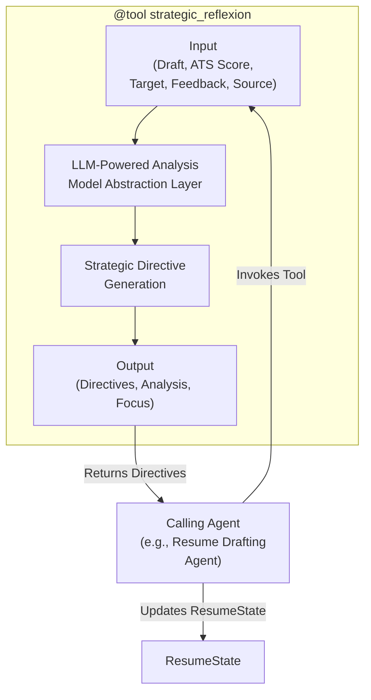

# Tool Architecture: Strategic Reflexion

This document details the architecture and role of the Strategic Reflexion Tool within the LangGraph Cognitive Agent Backend for Resume-LM. This tool is invoked by other agents (e.g., the resume drafting agent) when the resume tailoring process requires strategic replanning due to unmet objectives or specific revision requests.



## 1. Strategic Role

The Strategic Reflexion Tool provides an on-demand mechanism for global, objective-driven replanning. Instead of being a fixed subgraph in the workflow, it's a callable LangChain tool (`@tool`) that can be invoked by various agents (like the `resume_drafting_agent` or a dedicated `reflexion_agent` if one is orchestrated by the supervisor) when they encounter situations requiring more than simple iterative adjustments.

Its strategic role is to:
1.  Analyze the reasons for failure (e.g., low ATS score) or the nature of complex revision requests (e.g., from human feedback).
2.  Generate higher-level `strategic_directives`.
These directives then guide the calling agent on *how* to approach the next revision attempt, aiming for a more successful outcome. This allows the system to learn from its attempts and adjust its overall approach in a flexible manner.

## 2. Core Responsibilities (of the Tool Function)

*   **Feedback Analysis:** Ingest and analyze feedback from various sources (`ats_feedback`, `human_feedback`), along with the current draft and objectives provided as arguments.
*   **Failure Pattern Identification:** Identify recurring issues or systemic problems in the current draft.
*   **Root Cause Analysis (Conceptual):** Attempt to infer why the objectives were not met.
*   **Strategic Directive Generation:** Create actionable, high-level strategies. These are not just edits but can include:
    *   Re-prioritizing certain sections or content types.
    *   Suggesting a different angle or emphasis for specific experiences.
    *   Advising on how to better integrate specific keywords or themes.
*   **Return Structured Output:** Provide the generated directives and analysis in a structured format.

The tool itself does not directly update the `ResumeState`; the calling agent is responsible for using the tool's output to modify the state (e.g., by populating `ResumeState.strategic_directives`).

## 3. Inputs to Tool (Function Arguments)

The `strategic_reflexion` tool accepts arguments defined by the `ReflexionInput` Pydantic model:

*   `current_draft: Dict`: Current resume draft content.
*   `ats_score: float`: Current ATS compatibility score.
*   `target_score: float`: Target ATS compatibility score.
*   `feedback: str`: Feedback from ATS system or human reviewer.
*   `feedback_source: str`: Source of feedback (e.g., "ats" or "human").

## 4. Outputs from Tool (Function Return Value)

The tool returns a dictionary containing:
*   `strategic_directives: Dict`: A structured representation of the generated strategies.
    *   Example: `{"directives": [{"type": "REPRIORITIZE_SECTION", ...}], "analysis": "...", "priority_focus": "..."}`
*   `analysis: str`: A summary of the analysis performed.
*   `priority_focus: str`: Key areas to focus on for improvement.

The calling agent will then typically place the `strategic_directives` (or a processed version) into the `ResumeState.strategic_directives` field to guide subsequent drafting attempts.

## 5. Pydantic Input Schema

```python
from pydantic import BaseModel, Field
from typing import Dict # Assuming Dict is from typing

class ReflexionInput(BaseModel):
    """Input schema for the strategic reflexion tool."""
    current_draft: Dict = Field(description="Current resume draft content")
    ats_score: float = Field(description="Current ATS compatibility score")
    target_score: float = Field(description="Target ATS compatibility score")
    feedback: str = Field(description="Feedback from ATS system or human reviewer")
    feedback_source: str = Field(description="Source of feedback (ats or human)")
```

## 6. Key Internal Steps (within the Tool Function)

1.  **Select LLM:** Use the Model Abstraction Layer (`model_registry`) to select an appropriate LLM based on requirements (e.g., strong reasoning, long context).
2.  **Construct Prompt:** Create a detailed prompt for the LLM, incorporating the `current_draft`, `ats_score`, `target_score`, `feedback`, and `feedback_source`. The prompt will guide the LLM to analyze the situation and generate strategic directives.
3.  **Invoke LLM:** Call the selected LLM with the constructed prompt.
4.  **Parse LLM Response:** Process the LLM's output to extract and structure the strategic directives, analysis, and priority focus into the tool's return format.

## 7. Implementation Example

This is the `strategic_reflexion` tool function as proposed by the user:

```python
from langchain_core.tools import tool
from langchain_core.messages import SystemMessage, HumanMessage # Added for clarity
from pydantic import BaseModel, Field
from typing import Dict # Assuming model_registry and parse_strategic_directives are defined elsewhere
# from .model_abstraction_layer import model_registry, ModelCategory # Conceptual import

# Placeholder for model_registry and parse_strategic_directives
# class ModelCategory: BASIC="basic"; REASONING="reasoning"; CREATIVE="creative"; ANALYTICAL="analytical"; COMPREHENSIVE="comprehensive"
# class model_registry:
#     @staticmethod
#     def get_model(requirements): return None # Placeholder
# def parse_strategic_directives(response): return {"analysis": "Parsed analysis", "priority_focus": "Parsed focus", "directives": []}


@tool("strategic_reflexion", args_schema=ReflexionInput)
def strategic_reflexion(
    current_draft: Dict,
    ats_score: float,
    target_score: float, 
    feedback: str,
    feedback_source: str
) -> Dict:
    """
    Analyze the current resume draft and feedback to generate strategic directives for improvement.
    """
    # Select appropriate model using abstraction layer
    # model = model_registry.get_model({ # Actual call to model_registry
    #     "required_capabilities": ["reasoning", "long_context"],
    #     "economy_mode": False,
    #     "primary_category": ModelCategory.REASONING,
    #     "response_format": "json"
    # })
    
    # Construct prompt based on feedback source
    if feedback_source == "ats":
        prompt_content = f"""
        The current resume draft scored {ats_score} in ATS compatibility, 
        below the target of {target_score}. The ATS system provided this feedback:
        
        {feedback}
        
        Analyze the issues and generate strategic directives to improve the resume.
        Focus on keyword optimization, section structure, and content relevance.
        Return a JSON object with keys "analysis", "priority_focus", and "directives" (a list of directive strings).
        """
    else:  # Human feedback
        prompt_content = f"""
        A human reviewer provided the following feedback on the resume:
        
        {feedback}
        
        Analyze this feedback and generate strategic directives to address the concerns.
        Prioritize the most important changes first.
        Return a JSON object with keys "analysis", "priority_focus", and "directives" (a list of directive strings).
        """
    
    # Get strategic directives from model (conceptual invocation)
    # response = model.invoke([ 
    #     SystemMessage(content="You are a strategic resume improvement expert. Output JSON."),
    #     HumanMessage(content=prompt_content)
    # ])
    
    # Placeholder for LLM call and parsing
    # directives_data = parse_strategic_directives(response.content) 
    directives_data = { # Placeholder response
        "analysis": f"Analysis based on {feedback_source} feedback.",
        "priority_focus": "Focus on keywords and achievements.",
        "directives": [
            f"Incorporate missing keywords from ATS feedback: {feedback[:50]}...",
            "Quantify achievements in experience sections."
        ]
    }
    
    return {
        "strategic_directives": directives_data.get("directives", []),
        "analysis": directives_data.get("analysis", ""),
        "priority_focus": directives_data.get("priority_focus", "")
    }
```

**Note on LLM Usage:** The LLM interaction within this tool is managed by the central Model Abstraction Layer (`model_abstraction_layer.md`). This layer handles dynamic model selection, provider abstraction, and fallback logic.

By implementing reflexion as a tool, the system gains flexibility, allowing agents to strategically seek guidance when needed, leading to more efficient and targeted revisions.
