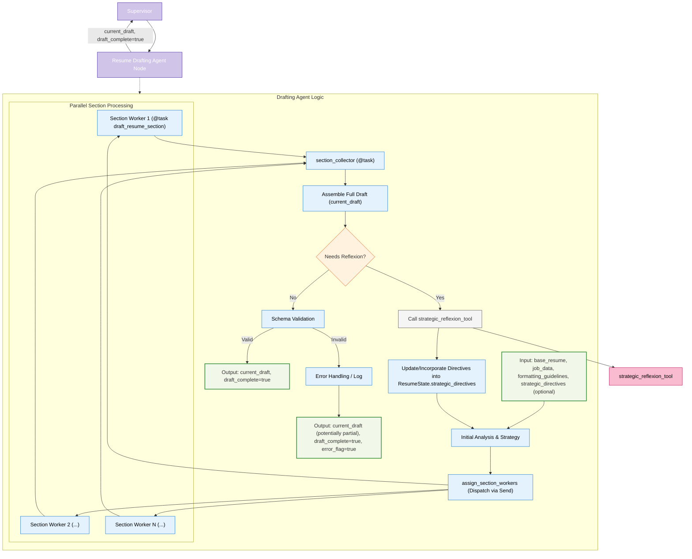

# Agent Node/Task Architecture: Resume Drafting & Formatting (RDF)

This document details the architecture and role of the Resume Drafting & Formatting (RDF) component within the LangGraph Cognitive Agent Backend for Resume-LM. This component is responsible for generating content that is both tailored to the job and adheres to specified formatting constraints, potentially leveraging parallel processing for sections and a strategic reflexion tool for guidance.



## 1. Strategic Role

The Resume Drafting & Formatting (RDF) component is the core content generation engine. Implemented as a sophisticated agent node or a primary `@task` function orchestrating other tasks, its strategic role is to:
1.  Take the user's base resume, structured job information, specific formatting guidelines (from `format_strategy_agent`), and any `strategic_directives` (from `reflexion_agent` or its own call to the `strategic_reflexion_tool`).
2.  Produce a tailored draft (`current_draft`) where content is generated in adherence to formatting constraints. This often involves **parallel processing of resume sections** for efficiency.
3.  Embed implicit STAR methodology for narrative sections within each section worker.
4.  Incorporate **internal reflection loops** (within section workers) to critique and refine individual content pieces.
5.  Optionally invoke the **`strategic_reflexion_tool`** if initial drafting attempts require higher-level strategic adjustments.
6.  Handle iterative revisions based on updated `strategic_directives`.

The output is a `current_draft` (JSON) intended to be layout-aware, along with a `draft_complete` flag.

## 2. Core Responsibilities

*   **Overall Draft Orchestration:** Manage the process of drafting all resume sections.
*   **Parallel Section Processing:** Dispatch individual resume sections to be drafted concurrently by `section_worker` tasks using LangGraph's `Send` API.
*   **Section Worker (`draft_resume_section` task):**
    *   Tailor content for a specific section based on base content, job data, section-specific formatting guidelines, and any active strategic directives.
    *   Adhere strictly to formatting guidelines (character counts, bullet limits).
    *   Implement implicit STAR methodology.
    *   Perform internal reflection (critique and revise) for quality and format adherence.
*   **Result Aggregation (`section_collector` task):** Collect and assemble results from parallel section workers.
*   **Strategic Reflexion Invocation:** If the assembled draft needs significant strategic rework (based on internal checks or if it's part of a global revision loop), invoke the `strategic_reflexion_tool`.
*   **Feedback Incorporation:** Integrate `strategic_directives` (from supervisor or self-invoked tool) to guide re-drafting.
*   **Schema Compliance:** Ensure the generated `current_draft` conforms to the Resume-LM JSON schema.

## 3. Inputs to Agent Node/Tasks

From `ResumeState` (or as direct arguments to an `@entrypoint` workflow):
*   `base_resume` (or `original_resume`): User's existing resume data.
*   `structured_job_data` (or `original_job_description` and parsed data).
*   `section_formatting_guidelines`: Detailed constraints from `format_strategy_agent`.
*   `strategic_directives` (Optional): Guidance from `reflexion_agent` or a previous call to `strategic_reflexion_tool`.
*   `user_preferences` (Optional).

## 4. Outputs from Agent Node/Tasks

Updates to `ResumeState` (returned as a dictionary by the agent/task):
*   `current_draft: dict`: The tailored resume JSON.
*   `draft_complete: bool`: A flag indicating if the drafting process for this iteration is complete.
*   `sections_by_name: dict` (Potentially): The collected results from section workers.
*   `strategic_directives` (Potentially updated if `strategic_reflexion_tool` was called).

## 5. Key Internal Steps / Logic

1.  **Initial Analysis & Strategy:**
    *   Parse `base_resume` into sections if not already done.
    *   Incorporate any incoming `strategic_directives`.
2.  **Dispatch Section Workers (`assign_section_workers` function):**
    *   For each resume section, create a payload including the section's base content, relevant job data, specific formatting guidelines, and current strategic directives.
    *   Use `langgraph.constants.Send` to dispatch these payloads to multiple instances of the `section_worker` task (`draft_resume_section_task`) for parallel processing.
3.  **Section Worker (`draft_resume_section_task`):**
    *   Receives its specific section data.
    *   Uses an LLM (via Model Abstraction Layer) with prompts that include content tailoring (STAR, keywords) AND formatting constraints.
    *   (Conceptual) May perform an internal reflection loop (critique & revise) for its generated section content.
    *   Returns the drafted section content.
4.  **Collect Results (`section_collector_task`):**
    *   Waits for all `section_worker` tasks to complete.
    *   Aggregates the drafted sections.
5.  **Assemble Full Draft:** Combine all drafted sections into the `current_draft` JSON structure.
6.  **Quality Check & Conditional Reflexion:**
    *   Perform an internal quality assessment on the `current_draft`.
    *   If issues are found that require strategic adjustment (or if this is a revision loop guided by poor global ATS/human feedback), invoke the `strategic_reflexion_tool` with the `current_draft` and relevant feedback context.
    *   If new `strategic_directives` are generated, update the state and potentially loop back to re-dispatch affected sections or the entire draft (step 1 or 2).
7.  **Schema Validation:** Validate the `current_draft` against the Resume-LM Zod schema. Handle errors appropriately.
8.  **Return Output:** Provide `current_draft` and set `draft_complete` to `True`.

## 6. Content Tailoring & Formatting Approach

Content is tailored for relevance and simultaneously shaped to fit pre-defined formatting constraints within each `section_worker`.

## 7. STAR Implementation Example (within a `section_worker`)

```python
# Conceptual, within a draft_resume_section_task
def tailor_and_format_experience_bullet(base_bullet_text, job_requirements, bullet_formatting_guideline, model_abstraction_layer_instance):
    star_prompt = f"""
    Original bullet idea: {base_bullet_text}
    Job requires skills in: {', '.join(job_requirements)}.
    Target keywords for this bullet: {', '.join(bullet_formatting_guideline.get('target_keywords', []))}.
    
    Rewrite this as a single, impactful bullet point using the implicit STAR method.
    Focus on achievements and quantifiable results.
    IMPORTANT: The final bullet point MUST be approximately {bullet_formatting_guideline.get('max_chars', 150)} characters long.
    Ensure it is concise and directly relevant.
    """
    # model = model_abstraction_layer_instance.get_model(...)
    # tailored_formatted_bullet = model.invoke(star_prompt).content
    tailored_formatted_bullet = f"Formatted STAR bullet for {job_requirements[0]} within {bullet_formatting_guideline.get('max_chars')} chars." # Placeholder
    return tailored_formatted_bullet
```

## 8. Handling Global Revisions

When the Supervisor routes to this RDF agent with existing `strategic_directives` in the `ResumeState` (from `reflexion_agent` or `human_review_agent`), the "Initial Analysis & Strategy" step incorporates these directives. The drafting process (parallel section workers) then uses these directives to guide content generation and refinement.

## 9. Implementation Examples (Functional API & ReAct Agent)

Based on user's proposals:

**Functional API Tasks for Parallel Drafting:**
```python
from langgraph.func import task
from langgraph.constants import Send
from typing import Dict, List, Any, Optional
# Assume SystemMessage, HumanMessage, model_registry, ModelCategory, ResumeState are defined

@task
def draft_resume_section_task(inputs: Dict[str, Any]) -> Dict[str, Any]: # section_name, base_section, job_data, formatting_guidelines, strategic_directives
    """Draft a single section of the resume. (Corresponds to user's draft_resume_section)"""
    section_name = inputs["section_name"]
    base_section_content = inputs["base_section_content"]
    job_data = inputs["job_data"]
    formatting_guidelines_all = inputs["formatting_guidelines"]
    strategic_directives = inputs.get("strategic_directives", [])

    section_guidelines = formatting_guidelines_all.get(section_name, {})
    section_specific_directives = [d for d in strategic_directives if d.get("section") == section_name]
    
    # model = model_registry.get_model({ # Actual call
    #     "required_capabilities": [ModelCategory.CREATIVE, ModelCategory.FORMATTING],
    #     "economy_mode": False,
    # })
    
    prompt_content = f"""
    Rewrite this resume section: '{section_name}' to match job requirements while following formatting guidelines.
    Original Content: {base_section_content}
    Job Requirements: {job_data}
    Formatting Guidelines: {section_guidelines}
    """
    if section_specific_directives:
        prompt_content += f"\nStrategic Improvement Directives:\n{section_specific_directives}\n"
    
    # response = model.invoke([
    #     SystemMessage(content="You are an expert resume writer."),
    #     HumanMessage(content=prompt_content)
    # ])
    # drafted_content = response.content
    
    # Placeholder for LLM call
    drafted_content = f"Drafted content for {section_name} adhering to guidelines."

    return {
        "section_name": section_name,
        "content": drafted_content,
        "character_count": len(drafted_content),
        "meets_guidelines": len(drafted_content) <= section_guidelines.get('char_limit', 100000)
    }

def assign_section_workers_logic(state: ResumeState) -> List[Send]:
    """Assign a worker to process each section in parallel."""
    # base_resume_sections = parse_resume_into_sections(state["base_resume"]) # Conceptual
    base_resume_sections = {"summary": "Old summary", "experience": "Old experience"} # Placeholder
    
    sends = []
    for section_name, section_content in base_resume_sections.items():
        task_input = {
            "section_name": section_name,
            "base_section_content": section_content,
            "job_data": state["structured_job_data"],
            "formatting_guidelines": state["section_formatting_guidelines"],
            "strategic_directives": state.get("strategic_directives", [])
        }
        sends.append(Send("draft_resume_section_task", task_input))
    return sends

@task
def section_collector_task(completed_sections: List[Dict[str, Any]]) -> Dict[str, Any]:
    """Collect and combine the results from parallel section processing."""
    sections_by_name = {section["section_name"]: section for section in completed_sections}
    # combined_resume_json = combine_sections_into_resume_json(sections_by_name) # Conceptual
    combined_resume_json = {"drafted_sections": sections_by_name} # Placeholder
    
    return {
        "current_draft": combined_resume_json,
        "sections_by_name": sections_by_name,
        "sections_processed": len(completed_sections)
    }

# ReAct Agent Style (for overall drafting orchestration or if not using parallel tasks)
# from langgraph.prebuilt import create_react_agent
# from ..tools.strategic_reflexion_tool import strategic_reflexion # Conceptual import

# tools = [strategic_reflexion]
# drafting_llm = model_registry.get_model(...) 
# react_drafting_agent_runnable = create_react_agent(llm=drafting_llm, tools=tools, prompt=...)

# def resume_drafting_agent_node(state: ResumeState) -> Dict[str, Any]:
#     """Orchestrates resume drafting, potentially using ReAct agent style."""
#     messages = [...] # Construct messages from state
#     if state.get("strategic_directives"):
#         messages.append(HumanMessage(content=f"Incorporate directives: {state['strategic_directives']}"))
#     
#     agent_output = react_drafting_agent_runnable.invoke({"messages": messages})
#     # draft_content = extract_resume_from_agent_output(agent_output) # Conceptual
#     draft_content = {"extracted_resume": "from ReAct agent"} # Placeholder
#
#     # This node would then decide if draft_complete is true or if more steps / reflexion needed
#     return {"current_draft": draft_content, "draft_complete": True}

```

**Note on LLM Usage:** All LLM interactions (drafting, internal reflection, tool calls) are managed by the central Model Abstraction Layer (`model_abstraction_layer.md`).

The RDF component is pivotal in producing a resume that is not just well-written but also well-structured for its final form from an early stage, leveraging parallelism and strategic guidance effectively.
