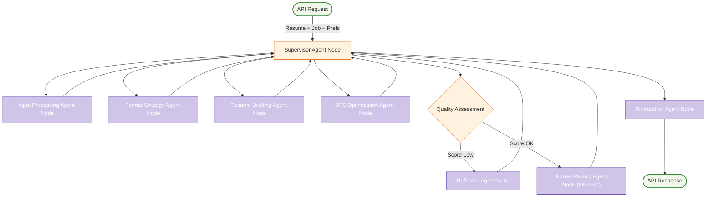

# Supervisor Graph Architecture: LangGraph Cognitive Agent Backend

This document details the architecture and role of the main Supervisor Agent in the LangGraph Cognitive Agent Backend for Resume-LM, following a hybrid architecture where the supervisor delegates tasks to specialized agent nodes.



## 1. Strategic Role of the Supervisor Agent

The Supervisor Agent serves as a lightweight central coordinator in a hybrid architecture. It manages the overall workflow by routing tasks and state to specialized, independent agent nodes. Its primary role is to make high-level decisions based on the current `ResumeState` (particularly the `current_phase`) and delegate the detailed processing to the appropriate agent node. This approach promotes modularity and allows each agent to focus on its specific responsibilities.

Its goal is to orchestrate the resume generation process from initial input to a high-quality, layout-aware, ATS-optimized, and potentially human-approved final output, by managing transitions between these specialized agent nodes.

## 2. Core Responsibilities

The Supervisor Agent has the following core responsibilities:

*   **State Initialization:** Receives initial inputs (job description, base resume, user preferences) and initializes the shared `ResumeState`.
*   **Workflow Orchestration:** Based on `ResumeState.current_phase`, routes control to the appropriate specialized agent node using `Command` objects. Key agent nodes include:
    *   `input_processing_agent`
    *   `potential_objective_setting_agent` (Note: User's supervisor example combines this with input processing or formatting strategy implicitly. For clarity, we can keep it distinct conceptually or merge as per detailed agent design).
    *   `format_strategy_agent`
    *   `resume_drafting_agent`
    *   `ats_optimization_agent`
    *   `reflexion_agent` (conditionally)
    *   `human_review_agent` (conditionally, using native interrupts)
    *   `finalization_agent`
*   **Quality Evaluation & Decision Making:**
    *   Evaluates `ats_score` from `ats_optimization_agent` against `target_ats_objective`.
    *   Implements "Quality Gate" logic: if the target is not met, routes to `reflexion_agent`.
*   **Human Interrupt Management:** Routes to `human_review_agent` if enabled and quality gate passed. Processes `human_decision` to either route to `finalization_agent` or `reflexion_agent`.
*   **State Consistency:** Ensures `ResumeState` is correctly updated by agent nodes (agents return updates via `Command`). The supervisor itself primarily updates `current_phase` and error fields.
*   **Error Handling (High-Level):** Can route to an error handling state or `END` if an agent node fails or an unknown phase is encountered.
*   **Final Output Preparation:** Signals `END` after the `finalization_agent` completes, allowing the graph to terminate and return the final `ResumeState`.

## 3. Key Decision Points & Conditional Logic

    *   **Initial Routing Sequence:** `input_processing_agent` -> `format_strategy_agent` -> `resume_drafting_agent`. (Note: `potential_objective_setting_agent` can be a distinct step or integrated).
    *   **Post-ATS Optimization (Quality Gate):**
        *   **Condition:** `ats_score` vs `target_ats_objective`.
        *   **If Target Not Met:** Routes to `reflexion_agent`. The `reflexion_agent` (or a tool it uses) provides strategic directives, and the Supervisor routes back to `resume_drafting_agent`.
        *   **If Target Met:** Proceeds to `human_review_agent` (if enabled) or `finalization_agent`.
    *   **Post-Human Review:**
        *   **If Approved:** Proceeds to `finalization_agent`.
        *   **If Revision Requested:** Routes to `reflexion_agent`. The `reflexion_agent` incorporates human feedback into strategic directives, and Supervisor routes back to `resume_drafting_agent`.
*   **Maximum Revisions:** Logic for limiting revision loops can be implemented within the supervisor by tracking a `revision_count` in `ResumeState`.

## 4. State Management (`ResumeState`)

The `ResumeState` (a TypedDict) is the central data structure. The Supervisor Agent reads `current_phase` and other relevant fields to make routing decisions. Agent nodes receive the state, perform their tasks, and return updates to the state, which LangGraph applies before the next invocation of the Supervisor or another node.

## 5. Interaction with Agent Nodes

The Supervisor delegates tasks to specialized agent nodes:
1.  The Supervisor is invoked with the current `ResumeState`.
2.  It determines the next agent node based on `current_phase` and other state conditions.
3.  It returns a `Command(goto="next_agent_node_name", update={"current_phase": "new_phase_after_next_agent"})`.
4.  LangGraph executes the specified `next_agent_node_name`.
5.  The agent node performs its task, potentially updating parts of the `ResumeState`, and returns its own `Command` (often `goto="supervisor"`) with its state updates.

## 6. Conceptual Implementation (Python Snippet - Hybrid Supervisor)

This implementation is based on the user's provided example, showcasing the hybrid supervisor model.

```python
from typing import TypedDict, Dict, List, Any, Literal, Optional
from langgraph.graph import StateGraph, START, END # For graph construction context
from langgraph.types import Command # Essential for supervisor routing

# Define ResumeState (as provided by user, slightly augmented for completeness)
class ResumeState(TypedDict):
    job_description: str
    base_resume: str
    structured_job_data: Optional[Dict]
    current_phase: str
    ats_score: Optional[float]
    target_ats_objective: Optional[float]
    section_formatting_guidelines: Optional[Dict]
    current_draft: Optional[Dict] # Represents the layout_aware_draft_resume_json
    strategic_directives: Optional[List[str]]
    human_feedback: Optional[str]
    human_decision: Optional[Literal["approved", "revise", "timeout", "error"]]
    human_review_enabled: bool
    draft_complete: Optional[bool] # Flag from resume_drafting_agent
    error: Optional[str]
    # Potentially other fields like:
    # potential_objective_data: Dict 
    # ats_optimization_report: Dict
    # finalization_report: Dict
    # revision_count: int

# Supervisor Node Implementation (based on user's example)
def supervisor(state: ResumeState) -> Command[Literal[
    "input_processing_agent", 
    "format_strategy_agent", 
    "resume_drafting_agent", 
    "ats_optimization_agent", 
    "reflexion_agent", 
    "human_review_agent", 
    "finalization_agent", 
    END
]]:
    """Central coordinator that routes between specialized agent nodes."""
    current_phase = state.get("current_phase", "initial") # Default to 'initial'
    
    if current_phase == "initial":
        return Command(goto="input_processing_agent", update={"current_phase": "after_input_processing"})
        
    elif current_phase == "after_input_processing":
        # Assuming potential_objective_setting is part of or follows input_processing
        # Or add a dedicated phase and agent for it if needed.
        return Command(goto="format_strategy_agent", update={"current_phase": "after_format_strategy"})
        
    elif current_phase == "after_format_strategy":
        return Command(goto="resume_drafting_agent", update={"current_phase": "after_drafting", "draft_complete": False})
    
    elif current_phase == "after_drafting":
        if not state.get("draft_complete"): # Loop back to drafting if not complete (e.g. for parallel sections)
             return Command(goto="resume_drafting_agent") # No phase change, agent handles its internal state
        return Command(goto="ats_optimization_agent", update={"current_phase": "after_ats_optimization"})
    
    elif current_phase == "after_ats_optimization":
        if state.get("ats_score", 0.0) < state.get("target_ats_objective", 0.85):
            return Command(goto="reflexion_agent", update={"current_phase": "after_reflexion", "feedback_source": "ats"})
        else:
            if state.get("human_review_enabled", True):
                return Command(goto="human_review_agent", update={"current_phase": "after_human_review"})
            else:
                return Command(goto="finalization_agent", update={"current_phase": "after_finalization"})
    
    elif current_phase == "after_reflexion":
        # After reflexion, return to drafting with new directives
        return Command(goto="resume_drafting_agent", update={"current_phase": "after_drafting", "draft_complete": False})
        
    elif current_phase == "after_human_review":
        human_decision = state.get("human_decision")
        if human_decision == "approved":
            return Command(goto="finalization_agent", update={"current_phase": "after_finalization"})
        elif human_decision == "revise":
            return Command(goto="reflexion_agent", update={"current_phase": "after_reflexion", "feedback_source": "human"})
        else: # Timeout or error during human review
             return Command(goto="finalization_agent", update={"current_phase": "after_finalization"}) # Default to finalize
    
    elif current_phase == "after_finalization":
        return Command(goto=END)
    
    # Fallback for unknown states
    print(f"Error: Unknown phase {current_phase}")
    return Command(goto=END, update={"error": f"Unknown state: {current_phase}"})

```

This hybrid supervisor architecture, leveraging `Command` for routing, allows for a modular and maintainable system where specialized agents handle specific tasks.
