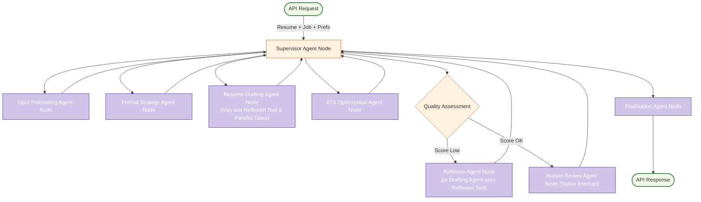

# System Patterns: LangGraph Cognitive Agent Backend for Resume-LM

## 1. System Architecture Overview

The LangGraph Cognitive Agent Backend for Resume-LM implements a sophisticated, multi-step, and stateful process for tailoring resumes. It is designed as a **hybrid supervisor-agent system**. A lightweight central `Supervisor Agent Node` orchestrates a series of specialized, independent `Agent Nodes` or collections of `@task` functions, each responsible for a distinct phase of the resume tailoring workflow. This architecture allows for complex decision-making, iterative refinement (through tool-based reflexion and internal reflection within drafting tasks), and the integration of human feedback using native LangGraph interrupts.

The backend will function as an API layer, callable by the main Resume-LM application, to replace the previous Vercel AI SDK-based tailoring mechanism.

## 2. Key Technical Decisions

*   **LangGraph Framework:** Chosen for its ability to build stateful, multi-actor applications, enabling complex workflows, conditional logic, and cycles for iteration.
*   **Python:** Selected as the primary programming language due to LangGraph's Python-native design and the rich ecosystem of NLP and AI libraries.
*   **Functional API (`@task`, `@entrypoint`):** Core workflow components are defined as decorated Python functions for clarity, testability, and easier state management.
*   **Hybrid Supervisor-Agent Orchestration:** A lightweight central supervisor node manages high-level routing using `Command` objects, delegating specific tasks to specialized agent nodes or task collections.
*   **Modular Agent-Node Architecture:** The problem of resume tailoring is decomposed into specialized agent nodes or functional task groups, promoting modularity and maintainability.
*   **Tool-Based Reflexion:** Strategic replanning (Reflexion) is implemented as a callable LangChain tool (`@tool`), allowing drafting agents or a dedicated reflexion agent to invoke it on-demand.
*   **Native Interrupts for HITL:** LangGraph's built-in `interrupt` mechanism is used for the human review step, ensuring robust state persistence and resumption.
*   **Dynamic Parallel Processing (`Send` API):** For decomposable tasks like resume section drafting, LangGraph's `Send` API is used to dispatch work concurrently, improving performance.
*   **Structured Error Handling & Fallbacks:** Implemented via model fallbacks in the Model Abstraction Layer and safe task wrappers with retry logic for critical operations.
*   **Docker:** To be used for containerizing the backend service.
*   **Resume-Matcher Integration:** Direct integration within the `ats_optimization_agent` for ATS compatibility scoring.
*   **Stateful Processing:** A comprehensive `ResumeState` TypedDict is used.
*   **Integrated Formatting within Drafting:** Formatting constraints are considered *during* content drafting.
*   **Internal Reflection:** Local critique and refinement loops remain a concept within drafting tasks/agents.
*   **API-First Design:** The backend is an API layer for Resume-LM.
*   **Model Abstraction Layer:** A dedicated utility layer (`model_abstraction_layer.md`) manages all LLM interactions, providing dynamic model selection, provider abstraction, context estimation, and fallback logic.

## 3. Design Patterns & Component Relationships

*   **Hybrid Supervisor-Agent Pattern:** The `Supervisor Agent Node` acts as the central, lightweight coordinator.
*   **Agent/Task Specialization (Single Responsibility Principle):** Each agent node (e.g., `input_processing_agent`) or collection of `@task` functions focuses on a specific part of the workflow.
*   **Functional Task Definition (`@task`):** Individual processing steps are defined as decorated functions.
*   **Workflow Entrypoint (`@entrypoint`):** The main graph is defined using this decorator for clarity and integration with checkpointing.
*   **Tool Pattern (`@tool`):** Components like strategic reflexion are implemented as tools callable by agents.
*   **Parallel Dispatch/Collect (`Send` API):** Used by drafting agents for concurrent section processing.
*   **Native Interrupt Pattern (LangGraph `interrupt`):** For human-in-the-loop processes.
*   **Stateful Workflow:** The `ResumeState` object is central.
*   **Conditional Edges (LangGraph):** Used by the Supervisor for routing based on `Command` objects and state conditions.
*   **Cycles/Feedback Loops:**
    *   Internal reflection loops within drafting tasks.
    *   Global revision loops managed by the `Supervisor`, routing back to the `resume_drafting_agent` after input from `reflexion_agent` or `human_review_agent`.
*   **Strategy Pattern (Conceptual):** The `format_strategy_agent` encapsulates formatting planning. Reflexion, as a tool, provides strategic guidance.
*   **Model Abstraction & Registry Pattern:** The `ModelRegistry` within the Model Abstraction Layer is central for LLM access.

## 4. Data Flow Overview

1.  **Initial Input & State Initialization:** API request received, `Supervisor Agent Node` initializes `ResumeState`. The main workflow is invoked via an `@entrypoint` decorated function.
2.  **Input Processing & Objective Definition (Sequential Tasks):**
    *   `input_processing_agent` (or related `@task`s) structures job data (using Model Abstraction Layer).
    *   `potential_objective_setting_agent` (or tasks) determines max ATS potential and sets `target_ats_objective` (using Model Abstraction Layer).
    *   `format_strategy_agent` (or tasks) calculates `section_formatting_guidelines` (using Model Abstraction Layer).
    Each of these returns control to the `Supervisor Agent Node` which routes to the next.
3.  **Resume Drafting & Formatting (Potentially Parallel with Internal Reflection):** The `resume_drafting_agent` (which might be a complex node or orchestrate parallel `@task`s using `Send`) generates layout-aware content. It adheres to `section_formatting_guidelines` and uses internal reflection. It can call the `strategic_reflexion_tool` if it encounters issues. (All LLM interactions via Model Abstraction Layer).
4.  **ATS Optimization & Evaluation:** The `ats_optimization_agent` (or tasks) analyzes the draft, generating an ATS score and feedback (LLM-enhanced feedback via Model Abstraction Layer).
5.  **Quality Gate & Reflexion (if needed):** The `Supervisor Agent Node` evaluates the ATS score.
    *   If below threshold, it routes to the `reflexion_agent` (or a state where the `resume_drafting_agent` is re-invoked with directives from the `strategic_reflexion_tool`).
    *   If above threshold, it proceeds.
6.  **Human Review (Optional) & Reflexion (if needed):**
    *   If triggered, the `human_review_agent` uses LangGraph's `interrupt` to present the draft.
    *   If revisions are requested, the `Supervisor` routes to the `reflexion_agent` (or similar).
    *   If approved, it proceeds.
7.  **Final Validation & Packaging:** The `finalization_agent` (or task) performs final schema checks and assembles reports. **No content or formatting modifications occur here.**
8.  **Final Output:** The `Supervisor Agent Node` routes to `END`, and the workflow concludes, returning the final `ResumeState`.

The `ResumeState` is the central data carrier.

## 5. Key Agent Nodes & Functional Components Overview

*   **Supervisor Agent Node:** Orchestrates the workflow using `Command` objects, manages state transitions based on `current_phase`.
*   **Input Processing Agent/Tasks:** Normalizes job inputs, structures job data, extracts requirements (uses Model Abstraction Layer).
*   **Potential Objective Setting Agent/Tasks:** Estimates max ATS potential, sets realistic target ATS objectives (uses Model Abstraction Layer).
*   **Format Strategy Agent/Tasks:** Defines formatting constraints for drafting (uses Model Abstraction Layer).
*   **Resume Drafting Agent/Tasks (RDF):** Generates tailored resume content, adhering to formatting guidelines. May use parallel processing (`Send`) for sections and call the `strategic_reflexion_tool`. Includes internal reflection loops (uses Model Abstraction Layer).
*   **ATS Optimization Agent/Tasks:** Evaluates RDF's output for ATS compatibility, provides scores and feedback (uses Model Abstraction Layer).
*   **Reflexion Agent/Tool:** Analyzes failure patterns and generates strategic directives. Implemented as a `@tool` callable by other agents or as a dedicated agent node (uses Model Abstraction Layer).
*   **Model Abstraction Layer (Utility):** A crucial utility layer (`model_abstraction_layer.md`) used by all components requiring LLM interactions.
*   **Human Review Agent Node:** Facilitates optional human oversight using LangGraph `interrupt`.
*   **Finalization Agent/Task:** Performs final schema checks and assembles reports.

## 6. API Design Considerations

(As previously stated - focus on robust request/response schemas, especially for conveying feedback and status).

## 7. Error Handling and Edge Case Strategy

(As previously stated - each component handles relevant edge cases, Supervisor handles overarching errors).
